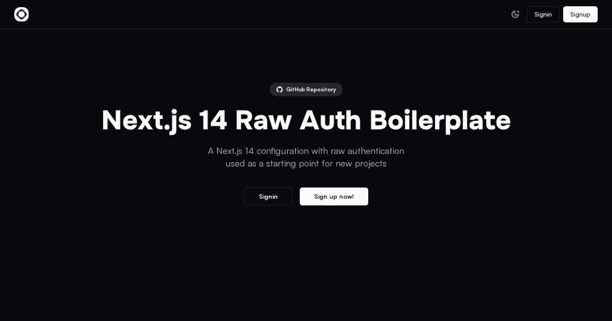

# [Next.js 14 Raw Auth Boilerplate](https://nextjs14-raw-auth-boilerplate.vercel.app)

A [Next.js 14](https://nextjs.org/docs/14) configuration with raw authentication used as a starting point for new projects.

[](https://nextjs14-raw-auth-boilerplate.vercel.app)

> **Warning**
> This project is only for practice and is not for production use.
>
> Uses non-recommended technologies (Nodemailer) that is used only for practice and is not safe for production.

## Tech Stack

- **Framework:** [Next.js 14](https://nextjs.org/docs/14)
- **Styling:** [Tailwind CSS 3](https://v3.tailwindcss.com)
- **UI Components:** [shadcn/ui](https://ui.shadcn.com)
- **Database:** [MySQL 8](https://mysql.com)
- **Email:** [Nodemailer](https://nodemailer.com/)

## Features to be implemented

- [x] Validation with **Zod**
- [ ] Raw authentication using **MySQl** and **Nodemailer**
- [ ] Newsletter subscription with **Nodemailer**
- [ ] Admin dashboard for each role

## Import Order

- react
- next
- env
- third-party-modules
- types
- config
- lib
- hooks
- db
- components/ui
- components/layouts
- components
- styles
- assets
- app


## Running Locally

1. Clone the repository

   ```bash
   git clone https://github.com/saufth/nextjs14-raw-auth-boilerplate.git
   ```

2. Install dependencies using pnpm

   ```bash
   pnpm install
   ```

3. Copy the `.env.example` to `.env` and update the variables.

   ```bash
   cp .env.example .env.local
   ```

4. Start the development server

   ```bash
   pnpm run dev
   ```

Open [http://localhost:3000](http://localhost:3000) with your browser to see the result.

## Deploy on Vercel

The easiest way to deploy your Next.js app is to use the [Vercel Platform](https://vercel.com/new?utm_medium=default-template&filter=next.js&utm_source=create-next-app&utm_campaign=create-next-app-readme) from the creators of Next.js.

Check out our [Next.js deployment documentation](https://nextjs.org/docs/app/building-your-application/deploying) for more details.

## License

Licensed under the MIT License. Check the [LICENSE](./LICENSE.md) file for details.
